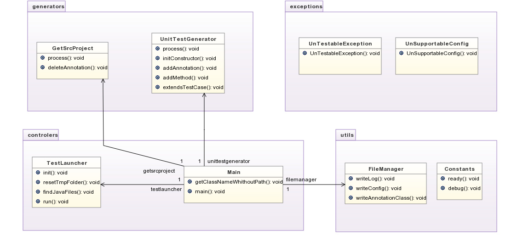

#TestCaseGenerator
Cette application exploite les annotations (UnitTest) présent au dessus des méthodes à tester afin de générer les tests puis les exécuter au runtime
dans le but de gagner du temps de développement et de travailler en mode TDD (Test driven development).

##Command [option]*

###Options :
--config : generate config file
 
--init   : generate config file and annotation class

--annotation : generate annotation class (.java)
 

###Config File parameters : 

JunitJar: (Required) specify the Junit jar file

MockitoJar: (Required) specify the Mockito jar file

ProjectSource: (Required) specify the java source of the project

LibForlder: (Required) specify the library folder (containing Mockito and Junit)

Verbose: enable verbose

LogFile: specify Log filename

TmpFolder: speficy temporary file

## UML Schema :

